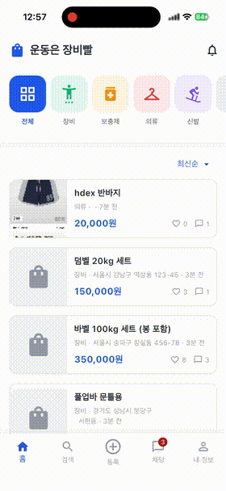
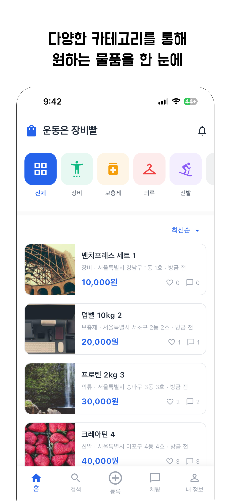
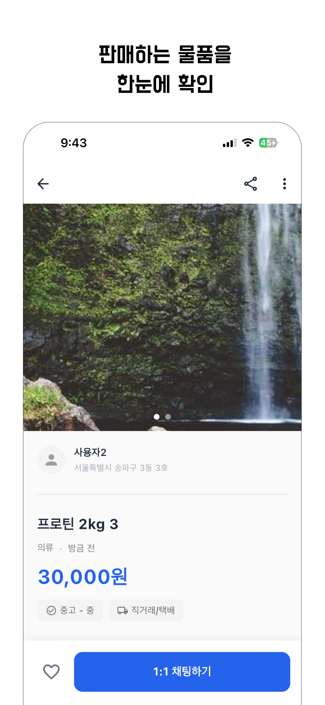
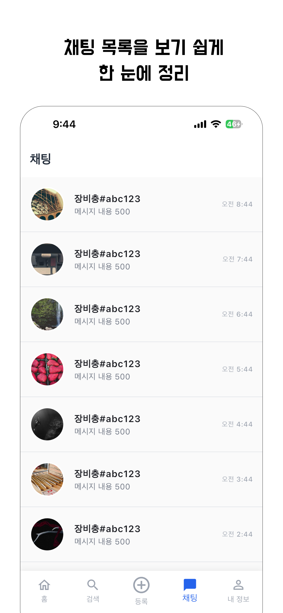
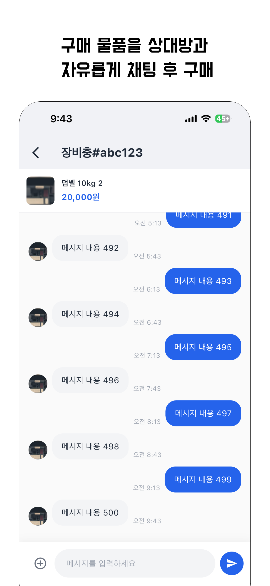
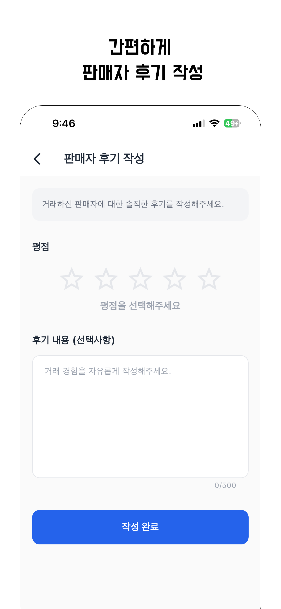
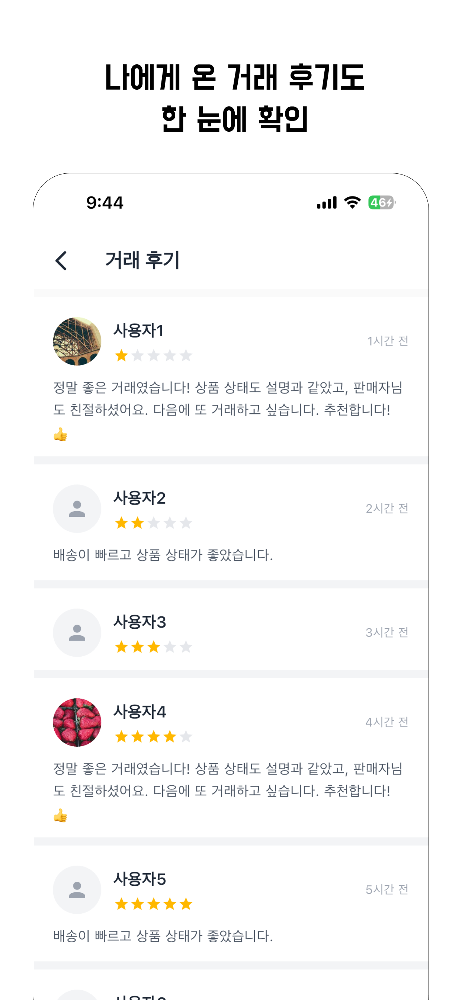

# Gear Freak (기어프릭)

> 중고 피트니스 장비 거래 플랫폼

Flutter + Serverpod 기반의 풀스택 모바일 앱으로, 실시간 채팅과 소셜 로그인을 지원합니다.

## 다운로드

<a href="https://apps.apple.com/kr/app/%EC%9E%A5%EB%B9%84%EB%B9%A8-%ED%94%BC%ED%8A%B8%EB%8B%88%EC%8A%A4-%EC%A4%91%EA%B3%A0%EA%B1%B0%EB%9E%98/id6757735322">
  
</a>
<a href="https://play.google.com/store/apps/details?id=com.pyowonsik.gearFreakFlutter">
  
</a>

## 데모 영상

<p align="center">
  
</p>

## 스크린샷

|                       로그인                        |                      홈 화면                       |                          상품 상세                           |                        채팅 목록                        |
| :-------------------------------------------------: | :------------------------------------------------: | :----------------------------------------------------------: | :-----------------------------------------------------: |
|  |  |  |  |

|                        채팅                        |                      리뷰 작성                       |                         리뷰 목록                         |
| :------------------------------------------------: | :--------------------------------------------------: | :-------------------------------------------------------: |
|  |  |  |

## 주요 기능

- **소셜 로그인** - 카카오, 네이버, 구글, 애플 OAuth 지원
- **상품 관리** - CRUD + S3 Presigned URL 이미지 업로드
- **실시간 채팅** - Serverpod 스트림 기반 메시징
- **푸시 알림** - FCM + 딥링크 화면 이동
- **리뷰 시스템** - 구매자 ↔ 판매자 양방향 리뷰
- **검색** - 상품 검색 + 최근 검색어 저장

## 기술 스택


**Client:** Flutter, Dart, Riverpod, GoRouter

**Backend:** Serverpod, PostgreSQL

**Infra:** Firebase (Auth, FCM), AWS S3, GitHub Actions

## 아키텍처

- Clean Architecture + Feature-First 구조
- Riverpod (상태 관리)
- Repository Pattern (데이터 레이어 추상화)
- UseCase Pattern (비즈니스 로직 분리)

## 실행 방법

```bash
# 서버 실행
cd gear_freak_server
dart pub get
dart run bin/main.dart

# 클라이언트 실행
cd gear_freak_flutter
flutter pub get

# .env 파일 생성 후 설정
# BASE_URL, KAKAO_NATIVE_APP_KEY

flutter run
```

## 개발

- **개발자:** 표원식
- **개발 기간:** 2024.11 ~ 2025.01
- **1인 개발** (기획, 디자인, 프론트엔드, 백엔드)

## 라이선스

MIT License
